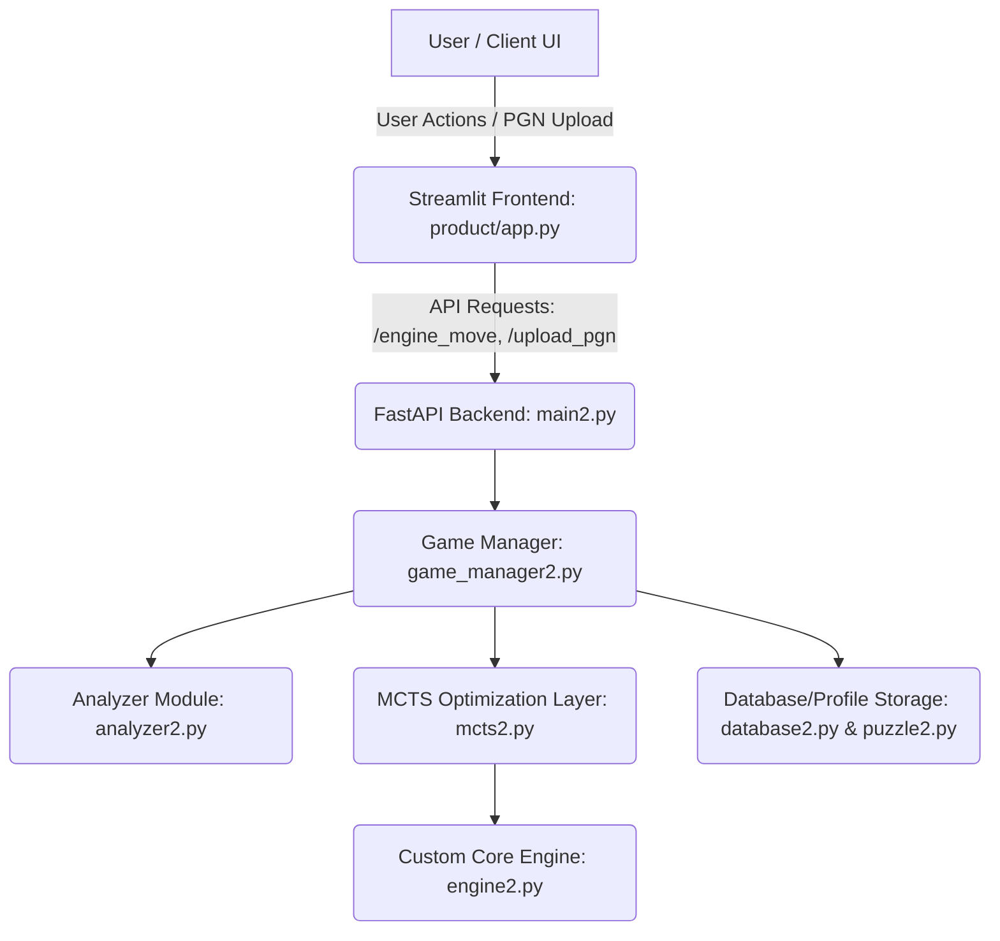

# ChessRL: An AlphaZero-Inspired Reinforcement Learning Chess Engine & Personalized Assistant

An advanced, end-to-end web-based chess coaching platform powered by a custom-built, AlphaZero-inspired reinforcement learning engine combined with a personalized tutoring system. Unlike traditional engines that act as black boxes, ChessRL bridges deep neural position evaluations with adaptive educational analysis.

---

##  Product Demo

[](YOUR_VIDEO_DEMO_LINK_HERE)

>  https://drive.google.com/drive/u/0/folders/1cieCRgUm2rGBY_RyMsV-BePhJci01g4T

---

##  Key Features

### 1. Analyze Game Page
* **PGN File Processing:** Paste or upload standard chess PGN files to trigger granular background parsing.
* **Automated Classification:** Uses a specialized evaluation pipeline to automatically tag moves as *Good Moves*, *Inaccuracies*, *Mistakes*, or *Blunders*.
* **Granular Positional Metrics:** Highlights average centipawn loss, best alternative variations, mistake types, and corresponding board positions.
* **Weakness Profiling:** Generates a structured summary showcasing specific tactical pitfalls across the entire match timeline.

### 2. Play Engine Page
* **Dynamic Simulation Calibration:** Seamlessly choose between three modular difficulty settings: **Easy**, **Medium**, or **Hard** (calibrates core MCTS execution simulation counts).
* **Robust Move Processing:** Real-time visual interface updates move history, dynamically updates the SVG board via FEN tracking, and instantly catches and logs illegal user submissions without crashing the runtime environment.
* **Post-Game Continuity:** Feature an "Export/Send to Coach" mechanism to seamlessly pass full match histories into the conversational explanation module.

### 3. Coach Chat (Personalized AI Assistant)
* **Context-Aware Interactions:** Automatically initializes state using active metadata from parsed user games or live play sessions.
* **Semantic Grounding:** Pre-wired backend configurations route session queries directly through an offline LLM layer (DeepSeek via Ollama) to output plain-language strategic guidance tailored to the user's specific playing style.

### 4. Interactive Puzzle System & User Dashboard
* **Dynamic Puzzle Matching:** Queries a vast Lichess data pool to extract, filter, and surface puzzles tailored precisely within a ±150 Elo window of the player's core tactical vulnerabilities.
* **Progress Telemetry:** The structural Dashboard maps real-time trends for cumulative games analyzed, active estimated Elo trajectories, and an aggregated historical weakness distribution chart.

---

##  Model Architecture & Technical Breakdown

The foundational intelligence layer bypasses heavy convolutional overhead by deploying an incredibly efficient network design optimized directly for consumer-tier execution limits.

### 1. NNUE HalfKP Backbone
* **High-Dimensional Mapping:** Implements a sparse binary feature matrix containing 40,960 dimensions (640 piece-squares × 64 king-squares) mapping structural piece-king positional relationships.
* **Incremental Aggregation:** Incorporates a fast hidden-layer accumulator framework. Instead of evaluating full neural passes across every board change, it processes localized variations tied strictly to active moving pieces, keeping inference targets <1ms on standard CPUs.

### 2. AlphaZero Dual-Head Architecture
* **Policy Head:** Implements two fully connected dense hidden layers mapping representations into a 4,672-dimensional action logit space representing all legal transformations (including complex pawn promotion vectors). Integrates explicit legal-move masks directly preceding the Softmax layer.
* **Value Head:** Routes shared features into parallel dense arrays terminating at a strict tanh activation boundary, yielding an evaluation scalar locked within [-1, +1] mapping pure win/loss probabilities.

### 3. Algorithmic Search Optimization
* **PUCT-Driven MCTS:** Guided selection balances exploitation tracks and exploration variance via the classic PUCT calculation framework.
* **Adaptive Multi-Tier Architecture:** Dynamically transitions parameters across game phases. The search budget utilizes deep 500–800 simulation boundaries during dense middlegames, adjusting down to structured depth-3 Alpha-Beta Minimax operations in clean endgame loops (≤ 10 non-king pieces) to completely suppress stochastic tree search noise.

---

##  Empirical Performance & Elo Validation

The engine performance was rigorously measured using programmatic, alternate-color match sequences against anchor implementations of Stockfish running with limited strength configurations (`UCI_LimitStrength`).

```text
--- Stockfish @ 1350 Elo Benchmark ---
Game 1/24 (W): W   Game 7/24 (W): D   Game 13/24 (W): W   Game 19/24 (W): W
Game 2/24 (B): D   Game 8/24 (B): W   Game 14/24 (B): L   Game 20/24 (B): L
Game 3/24 (W): L   Game 9/24 (W): L   Game 15/24 (W): D   Game 21/24 (W): L
Game 4/24 (B): L   Game 10/24 (B): W  Game 16/24 (B): D   Game 22/24 (B): W
Game 5/24 (W): W   Game 11/24 (W): L  Game 17/24 (W): W   Game 23/24 (W): L
Game 6/24 (B): L   Game 12/24 (B): L  Game 18/24 (B): D   Game 24/24 (B): L

Result: 8W 5D 11L | Cumulative Performance Score: 0.44
Final Verified Evaluation: ~1306 Elo
```

### Elo Tracking & Validation Proofs
* **Mathematical Verification Notebook:** Access the complete, unedited execution logs and verification scripts directly in our [Google Colab Validation Notebook](https://colab.research.google.com/drive/1NcUWF3wpufjrV6Leho5dYwP7t8PlTywX#scrollTo=WM59jUJ72Krp).

---

##  Technology Stack

* **Frontend UI Framework:** `Streamlit` (Selected for accelerated prototyping, low-overhead native Python bindings, and clean SVG canvas rendering capabilities).
* **Asynchronous Backend API:** `FastAPI` + `Uvicorn` (Manages atomic JSON communications, distinct routing logic, and parallel state operations).
* **Chess Environment Core:** `python-chess` (Provides deep out-of-the-box support for strict legal validation, FEN evaluation strings, and PGN tracking).
* **Comparative Evaluation Engine:** `Stockfish 14+` (Deployed purely as an external, isolated benchmarking utility for Elo validation).
* **Local Conversational Agent:** `Mistral-7B` / `DeepSeek` via `Ollama` (Pre-wired infrastructure for local, offline context generation).

---

##  Repository Structure & Architecture

A high-level view of the repository demonstrates a clean separation between the frontend interface component and the underlying core algorithmic engines:



### File Hierarchy Mapping
```text
ChessRL/
├── RL/                          # Core Reinforcement Learning Engine
│   ├── RL_training/             # Training configurations & checkpoint controls
│   ├── chess_env/               # Custom board state handling logic
│   ├── mcts/                    # Tree nodes and search selection properties
│   ├── MCTS_new.py              # Main MCTS pipeline implementation
│   ├── combined_network.py      # Dual-Head Policy/Value model architecture
│   ├── Feature_extractor.py     # 40,960 dim HalfKP mapping module
│   └── NNUE_Model.py            # Neural network update logic blocks
│
└── product/                     # Application & Production Layer
    ├── app.py                   # Main interactive Streamlit application
    ├── main2.py                 # FastAPI operational routing interface
    ├── game_manager2.py         # State manager isolating API logic from board logic
    ├── analyzer2.py             # Move classification and centipawn analysis engine
    ├── database2.py             # SQLite persistence profile manager
    └── puzzle2.py               # Custom puzzle filtering execution module
```
> *Note: Files appended with `2` indicate reference and modified modules prepared for a safe merge sequence across active development branches.*

---

##  Getting Started & Local Installation

### 1. Clone the Repository
```bash
git clone [https://github.com/aashima2310/RL-based-Chess-Assistant-.git](https://github.com/aashima2310/RL-based-Chess-Assistant-.git)
cd RL-based-Chess-Assistant-
```

### 2. Configure Environment and Dependencies
Ensure you have Python 3.10+ installed locally, then spin up an isolated virtual environment:
```bash
python -m venv venv
source venv/bin/activate  # On Windows use: venv\Scripts\activate
pip install -r requirements.txt
```

### 3. Run the Backend Server
Fire up the asynchronous web framework on port `8000`:
```bash
uvicorn product.main2:app --reload --port 8000
```

### 4. Launch the Streamlit Frontend App
In a parallel terminal instance, ignite the web interface on port `8501`:
```bash
streamlit run product/app.py
```

---

## Current Limitations & Roadmap

### Active Limitations
* **Tightly Coupled Weights:** The final, heavily optimized RL network parameters are still undergoing complex generation cycles; the system currently operates over a high-performance runtime MCTS engine prototype.
* **Local Operations:** LLM features and profile storage rely on local host instances (`Ollama` at `localhost:11434` and flat-file SQLite instances) rather than scale-ready containerized cloud systems.

### Future Enhancements
* Incorporate smooth, drag-and-drop click interactions on the chessboard UI instead of raw algebraic keyboard typing.
* Append dynamic evaluation bars, graphical asset displays for captured pieces, and integrated user authentication boundaries (`OAuth2`).
* Upgrade feature capacity to support deeper multi-layered hidden accumulator spaces.
